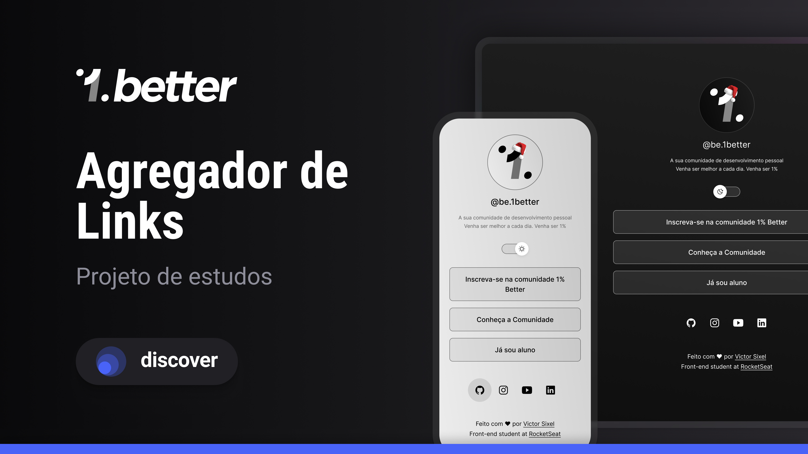

# EstudoDiscover

<h1 align="center"> Links 1% Better </h1>

Meu primeiro caso de estudos, onde pude criar uma agregador de links para a minha plataforma de ensino.

  <a href="#-tecnologias">Tecnologias</a>&nbsp;&nbsp;&nbsp;|&nbsp;&nbsp;&nbsp;
  <a href="#-projeto">Projeto</a>&nbsp;&nbsp;&nbsp;|&nbsp;&nbsp;&nbsp;
  <a href="#memo-licença">Licença</a>

  

 

  

## 🚀 Tecnologias

Esse projeto foi desenvolvido com as seguintes tecnologias:

- HTML e CSS
- JavaScript
- Git e Github
- Figma

## 💻 Projeto

Este é um agregador de links que será utilizado pela plataforma de ensino 1% Better.

## :memo: Licença

Esse projeto está sob a licença MIT.

---

Feito com ♥ by Victor Sixel :wave: [Participe da nossa comunidade!](https://1better.vercel.app/)
